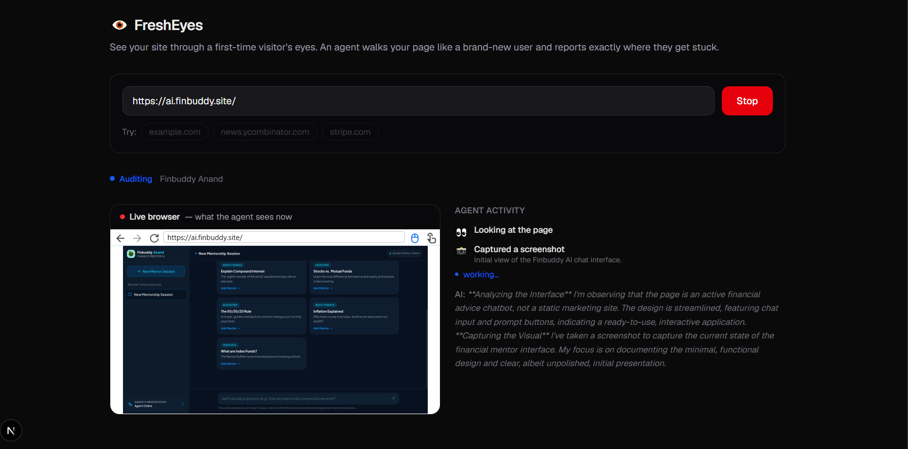
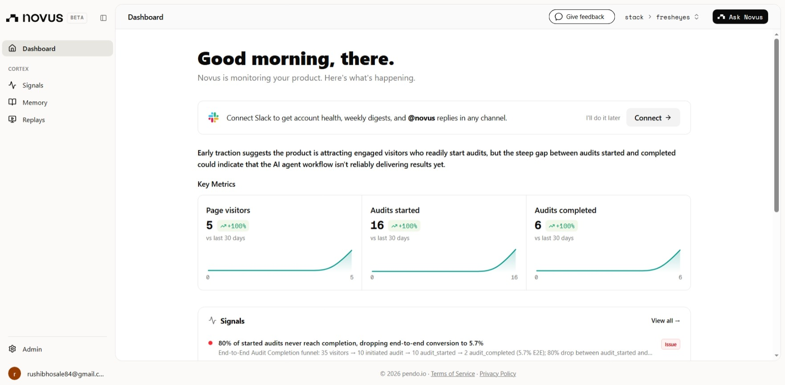

# 👁️ FreshEyes — see your site through a first-time visitor's eyes

> **You can't un-see your own product. FreshEyes can.** Paste a URL and an AI agent opens a real browser, walks your site like a brand-new visitor, and reports exactly where they get stuck — with a ranked, fixable report and screenshot evidence.

**🚀 [Try FreshEyes Live](#)** | **📹 [Watch the Demo](#)** | **📊 Measured with Novus**



---

## 📌 The Problem

The first 10 seconds a stranger spends on your site decide whether they stay. But the people who built it — founders, PMs, designers — are the *worst* judges of those 10 seconds, because they already know what the product is, who it's for, and where every button leads. You literally cannot experience your own site as a newcomer.

The usual ways to close that gap are bad:

- **Real user testing** is slow, expensive, and scheduled days out.
- **"Audit" tools** run Lighthouse and hand you performance scores — they never actually *try to use the thing* as a confused first-timer would.
- **Asking friends** gets you politeness, not the moment they got lost.

There's a gap between *"technically works"* and *"a real person lands on it and gets it."* Nothing lives in that gap. FreshEyes does.

---

## 💡 What FreshEyes Does

Paste any URL. FreshEyes:

1. **Opens a real cloud browser** and visits your site as a brand-new visitor — no logins, no assumptions.
2. **Streams every action live** — you watch it look, click, scroll, and react in real time, with its reasoning shown as it goes.
3. **Judges the whole first impression** across 11 dimensions — clarity, CTA, visual design, imagery, copy, navigation, trust, forms, accessibility, performance, and errors.
4. **Records each friction point** with a severity, a **concrete** fix (actual colors, button styles, copy — not "improve the design"), the page URL where it happened, and a **screenshot as evidence**.
5. **Returns a Markdown report** you can read inline, scrub through frame-by-frame, and export to **Markdown or PDF**.

Crucially, it's **calibrated, not padded**: FreshEyes first figures out *what kind of page this is* — a throwaway placeholder vs. a real product landing page — and matches the depth and severity of its audit to reality. A placeholder gets 1–2 honest low-severity notes, not an inflated list.

---

## 🎬 Demo & Deployment

- **Live Demo**: _coming soon_
- **Video Demo**: _coming soon_ (2–3 min walkthrough)

---

## 🏗️ Architecture

FreshEyes is a **brain + hands** agent: an LLM does the reasoning, a real cloud browser does the doing, and everything streams to the UI live over SSE.

```
User (paste URL)
        │
        ▼
  Next.js frontend  ──── Novus (Pendo) analytics
        │   ① POST /api/runs        → { runId }
        │   ② EventSource /events   ⇠ live SSE stream
        ▼
  Bun + Express backend
        ├─ Agent orchestrator (hand-rolled tool-calling loop)
        │     ├─ brain → OpenAI SDK → OpenRouter (the LLM)      [decide next action, judge friction, write report]
        │     └─ hands → Stagehand → Browserbase (real browser) [observe / act / screenshot]
        └─ streams: session(liveView) · thinking · step · screenshot · finding · done
```

### The agent loop

A **bounded** perceive → reason → act loop (hard cap of 14 turns). The model is given a small, robust toolset and drives the browser one decision at a time:

| Tool | What it does |
|---|---|
| `observe` | List the interactive elements a first-time visitor would see |
| `act` | Click / type / scroll, described in plain language |
| `screenshot` | Capture the current view as report evidence |
| `record_finding` | Log one issue — category, severity, description, concrete fix |
| `finish` | End the run (done / blocked) |

The loop is deliberately defensive — models can emit malformed tool calls, so every tool result (including parse errors) is fed back as a message the model can read and self-correct from, and a block (login wall, bot-check) becomes a *finding*, never a crash.

### Tech Stack

| Layer | Technology |
|---|---|
| Brain (LLM) | OpenAI SDK → **OpenRouter** (e.g. Google Gemini 2.5 Pro) — provider-agnostic |
| Hands (browser) | **Stagehand v3** on **Browserbase** (managed remote browser, live view) |
| Backend | **Bun + Express**, Server-Sent Events (SSE) |
| Frontend | **Next.js + React + Tailwind**, react-markdown, jsPDF |
| Analytics | **Novus** (Pendo agent) — auto-instrumented + custom funnel events |
| Audit rubric | `skill.md` — the agent's first-time-visitor knowledge base |

---

## 🧠 `skill.md` — the rubric *is* the product

The easy path is "tell an LLM to review a website." That produces generic, CTA-obsessed feedback that hallucinates problems to fill a list.

Instead, the agent's judgment lives in **[`skill.md`](./backend/src/agent/skill.md)** — a first-time-visitor audit guide loaded into the system prompt at startup. It defines:

- **How to calibrate** — judge the *kind* of page first, then match audit depth and severity to it. Never pad.
- **11 evaluation categories** — each with "what good looks like" and what to flag.
- **How to write a fix** — concrete and specific (real hex colors, button dimensions, type scale, exact copy), never vague advice.

Keeping the rubric in a markdown file means the product's "taste" can be tuned without touching a line of code — and the agent reads it the way a new design reviewer would read an onboarding doc.

---

## 🛡️ Reliability is the feature

An agent driving a real browser fails in a hundred ways. FreshEyes is engineered so a stranger's URL never produces a dead end:

- **Live view first** — the Browserbase session embeds in the UI within seconds, so the run never *looks* stuck.
- **Block-as-finding** — a login wall or bot-check is reported as friction, not an error.
- **Bounded + cancellable** — a hard turn cap, and a Stop button that actually aborts the agent server-side (closing the browser so no credits burn).
- **Run-once guard** — `EventSource` auto-reconnects on drop; the server guarantees a run executes exactly once so a reconnect can never re-trigger an audit.

---

## 📊 Measured with Novus

FreshEyes uses **Novus** (Pendo's product agent) for analytics. Novus connected to the repo, scanned the codebase, and opened PRs that install the SDK and auto-instrument the product — page views, click events, the audit funnel, and AI-agent analytics on the audit interaction itself. So real user behavior is measurable the moment the first stranger lands — without hand-writing tracking code.



**Proof:** the [`novus-proofs/`](./novus-proofs) folder has the live Novus dashboard plus detail views — visitors, the `audit_started → audit_completed` funnel, track events, session replays, AI-agent analytics, signals, and the auto-instrumentation PRs Novus opened on this repo.

---

## 🚀 Getting Started

### Prerequisites

- [Bun](https://bun.sh) 1.3+
- An [OpenRouter](https://openrouter.ai/keys) API key
- A [Browserbase](https://www.browserbase.com) account (API key + project ID)

### Environment variables

**`backend/.env`:**

```env
OPENROUTER_API_KEY=sk-or-v1-...
OPENROUTER_MODEL=google/gemini-2.5-pro
OPENROUTER_VISION=false           # true + a vision model = the agent SEES screenshots
BROWSERBASE_API_KEY=bb_live_...
BROWSERBASE_PROJECT_ID=...
# PORT=8787
# FRONTEND_ORIGIN=http://localhost:3000
```

**`frontend/.env.local`:**

```env
NEXT_PUBLIC_API_BASE=http://localhost:8787
```

### Install & run

```bash
# Backend (Bun + Express)
cd backend
bun install
bun run dev            # → http://localhost:8787

# Frontend (Next.js) — separate terminal
cd frontend
bun install
bun run dev            # → http://localhost:3000
```

Open http://localhost:3000, paste a URL (or click an example), and watch the agent work.

---

## 📁 Project Structure

```
fresheyes/
├── backend/                  # Bun + Express
│   └── src/
│       ├── server.ts         # Express app, SSE endpoints, run store
│       └── agent/
│           ├── runAgent.ts   # the agent loop (brain + hands fused)
│           ├── browser.ts    # Stagehand + Browserbase session
│           ├── client.ts     # OpenAI client pointed at OpenRouter
│           └── skill.md       # first-time-visitor audit rubric
└── frontend/                 # Next.js + Tailwind
    └── src/
        ├── app/
        │   ├── layout.tsx    # root layout + Novus snippet
        │   ├── page.tsx      # input · live view · activity · report
        │   └── globals.css
        └── lib/
            ├── useAudit.ts   # POST + SSE stream → React state
            ├── analytics.ts  # Novus custom events
            ├── export.ts     # Markdown + PDF export
            └── types.ts
```

---

## 🔮 What's Next

- **Background jobs for long audits** — large sites can take anywhere from ~5 minutes to an hour to crawl fully. Move audits onto a durable background job queue with persistent run storage, so a scan keeps running independent of the browser connection and users can close the tab and come back to a finished report.
- **Vision by default** — pair a vision-capable model with the existing `OPENROUTER_VISION` path so visual-design and imagery findings are judged from real pixels, not the DOM.
- **Multi-page journeys** — follow a full funnel (landing → pricing → signup), not just the first screen.
- **Before/after re-audits** — track a score over time as you ship fixes.
- **Persona modes** — audit as a "skeptical buyer," a "mobile user on slow data," or an "accessibility-first" visitor.
- **Shareable report links** — a public URL per audit for handing to your team.

---

## 🧠 What We Learned

- **The rubric is the product.** A plain "review this site" prompt produces generic, padded feedback. Moving the judgment into a calibrated `skill.md` — *figure out the page type first, then audit proportionately* — was the single biggest jump in output quality.
- **A defensive loop beats model choice.** Routing through OpenRouter (OpenAI-style tool calls) kept the agent provider-agnostic — swappable with a one-line change; the real win was a loop that feeds tool errors back so malformed calls self-correct instead of dead-ending.
- **Reliability beats cleverness for a demo.** The features that mattered most weren't the flashiest — live view, block-as-finding, a real Stop, and a run-once guard are what keep a stranger's URL from ever producing a blank screen.
- **Watching is the magic.** Streaming the agent's actions and reasoning live turned "an AI looked at your site" into "I watched an AI get confused by my site" — far more visceral and convincing.

---

## 📄 License

MIT License — see [LICENSE](./LICENSE)

---

## 🏆 Built for

[Mind the Product — World Product Day 2026: *Everyone Ships Now*](https://www.mindtheproduct.com/), sponsored by **Novus / Pendo**.

Built so anyone can finally see their own product through fresh eyes.
